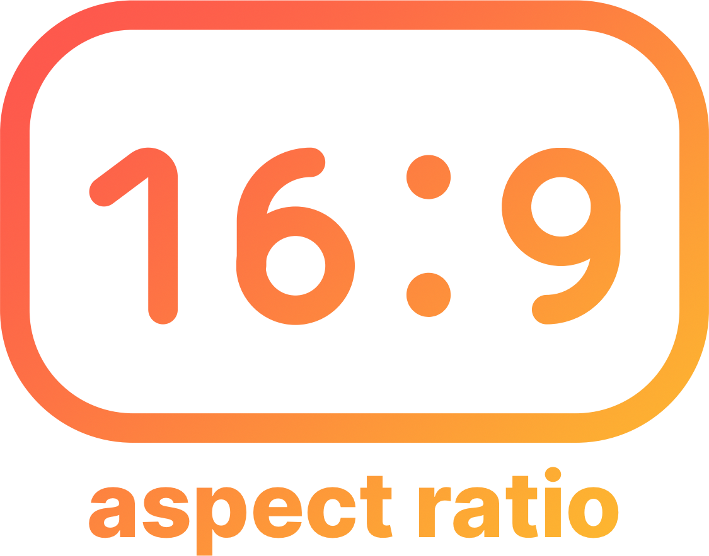

> Due to official aspect ratio support in TailwindCSS, this package is no longer maintained, use https://github.com/tailwindlabs/tailwindcss-aspect-ratio instead


<p align="center">
  
</p>

# Tailwind CSS Plugin – Aspect Ratio

<p align="center">
  
</p>

## Install

1. Install the plugin:

```bash
# Using npm
npm install @neupauer/tailwindcss-plugin-aspect-ratio --save-dev

# Using Yarn
yarn add @neupauer/tailwindcss-plugin-aspect-ratio -D
```

2. Add it to your `tailwind.config.js` file:

```js
// tailwind.config.js
module.exports = {
  // ...
  plugins: [require("@neupauer/tailwindcss-plugin-aspect-ratio")],
};
```

## Configuration

By default, some common aspect ratios are provided, but you can override or extend them with the `aspectRatio` key in your `tailwind.config.js` file.

```js
// tailwind.config.js
module.exports = {
  theme: {
    // default
    aspectRatio: {
      // Square
      "1:1": 1,
      // Landscape
      "2:1": 2 / 1,
      "3:1": 3 / 1,
      "3:2": 3 / 2,
      "4:1": 4 / 1,
      "4:3": 4 / 3,
      "5:4": 5 / 4,
      "16:9": 16 / 9,
      "16:10": 16 / 10,
      "19:10": 19 / 10,
      "21:9": 21 / 9,
      // Portrait
      "1:2": 1 / 2,
      "1:3": 1 / 3,
      "2:3": 2 / 3,
      "1:4": 1 / 4,
      "3:4": 3 / 4,
      "4:5": 4 / 5,
      "9:16": 9 / 16,
      "10:16": 10 / 16,
      "10:19": 10 / 19,
      "9:21": 9 / 21,
    },
  },
  variants: {
    // default
    aspectRatio: ["responsive"],
  },
};
```

## Usage

> The target element can only contain one child, the others will be hidden. If you need to add more child, wrap them within another element e.g., `<div>`

```html
<div class="aspect-ratio-16:9">
  
</div>

<div class="aspect-ratio-16:9">
  <div class="text-white bg-blue-500">Aspect Ratio</div>
</div>
```

```html
<!-- OK -->
<div class="aspect-ratio-16:9">
  <div>
    <p>Aspect</p>
    <p>Ratio</p>
  </div>
</div>

<!-- NOOK -->
<div class="aspect-ratio-16:9">
  
  <!-- visible-->
  
  <!-- hidden-->
  
  <!-- hidden-->
</div>
```

### Min-Aspect Ratio

```html
<div class="min-aspect-ratio-16:9">
  <p>Aspect Ratio</p>
</div>

<div class="min-aspect-ratio-16:9">
  <p>
    Aspect Ratio. Lorem ipsum dolor sit amet, consectetur adipisicing elit.
    Eius ullam iste distinctio nobis ipsum soluta dolorem esse omnis! Architecto
    impedit odio magni non repudiandae vitae veniam id dolorum sint eum. Lorem
    ipsum dolor sit amet, consectetur adipisicing elit. Eius ullam iste
    distinctio nobis ipsum soluta dolorem esse omnis! Architecto impedit odio
    magni non repudiandae vitae veniam id dolorum sint eum.
  </p>
</div>
```
